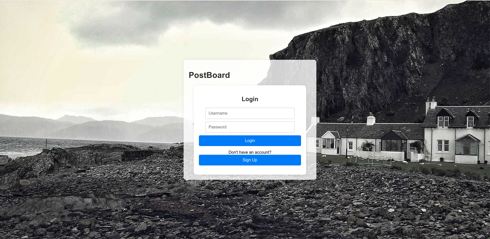
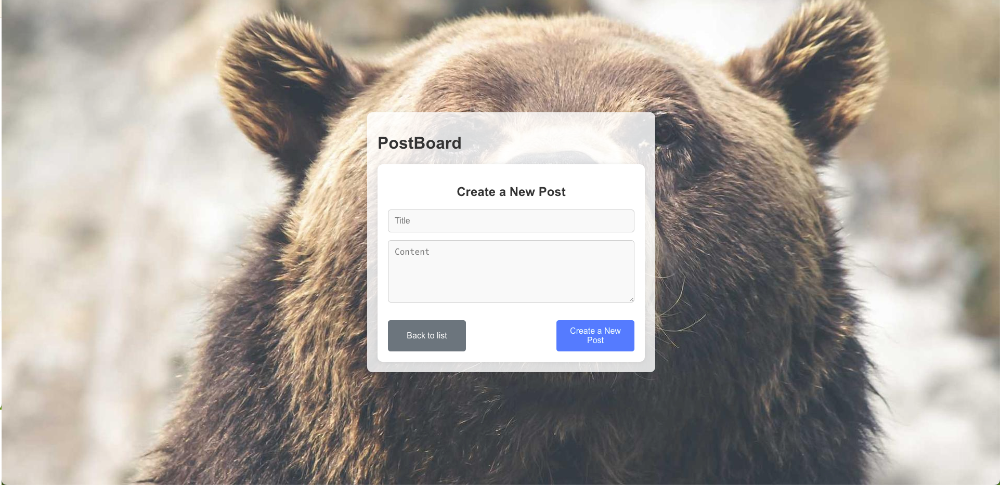
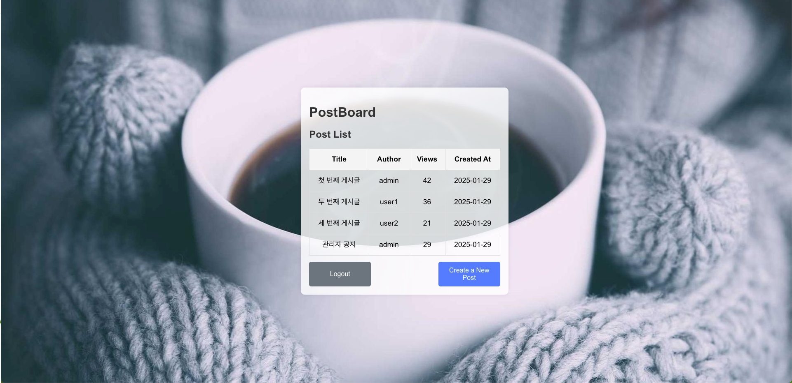
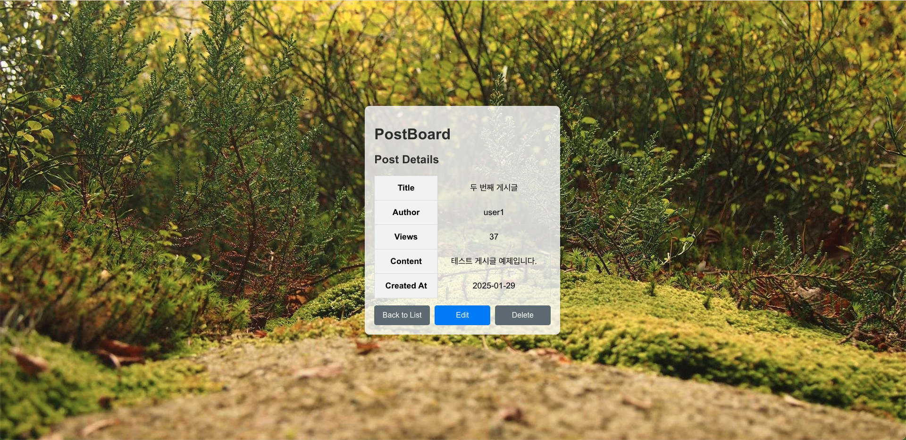
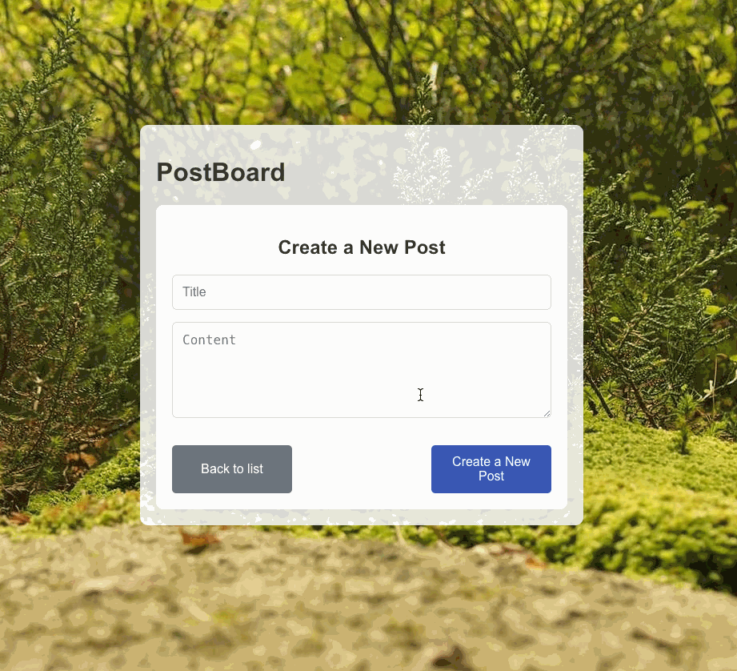
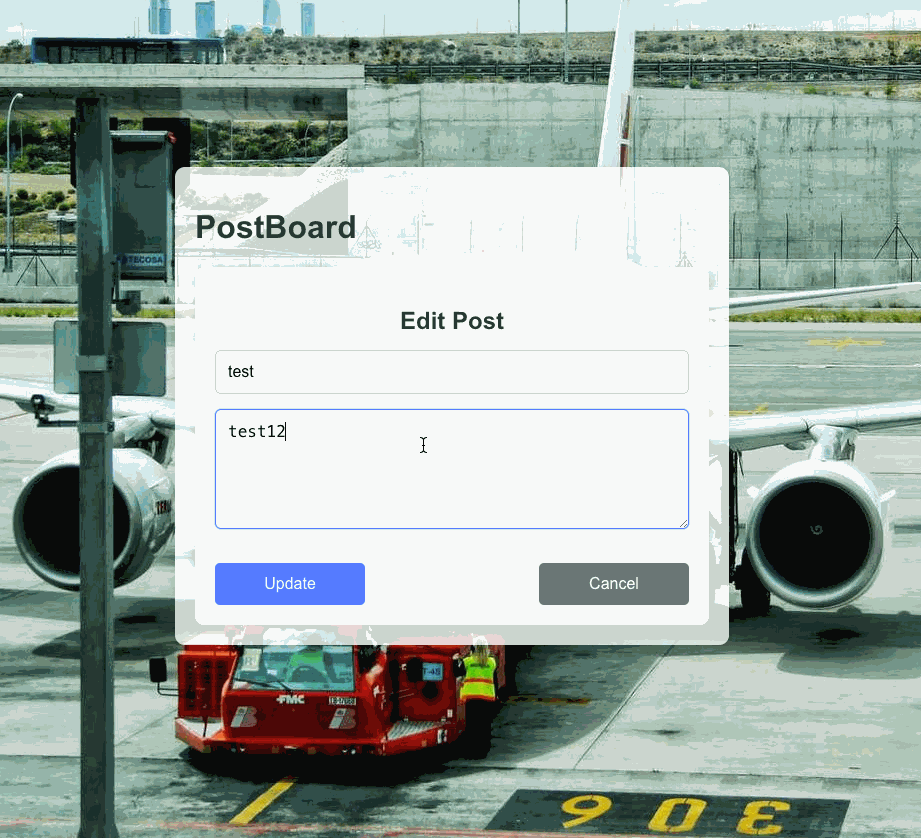

# 🏆 jjinkue-PostBoard-Project

A full-stack post board application built with **React, Node.js, Express, and MySQL**.  
Users can create, edit, view, and delete posts with authentication.  

📸 **Preview:**  


---

## 🚀 **Tech Stack**

| Frontend | Backend | Database | Authentication |
|----------|---------|----------|---------------|
| React | Node.js (Express) | MySQL | JWT (JSON Web Token) |

---

## 📸 **Project Screenshots**
### **📝 Create a Post**
  

### **📄 Post List**
  

### **🔍 View Post Details**
  

---

## 🛠 **Installation & Setup**
### **1️⃣ Clone the Repository**
```sh
git clone https://github.com/YOUR_GITHUB_USERNAME/jjinkue-PostBoard-Project.git
cd jjinkue-PostBoard-Project
```

### **2️⃣ Install Dependencies**
```sh
cd jjinkue-PostBoard-Project
npm install
```

### **3️⃣ Setup Environment Variables**

Copy `.env.example` and create `.env` :

```sh
cp .env.example .env
cp ./server/.env.example ./server/.env
```

Edit ``.env`` file and update credentials:

✅ **Frontend (`.env`)**

```sh
REACT_APP_API_BASE_URL=http://localhost:5001
```

✅ **Backend (`server/.env`)**
```sh
# Database Configuration
DB_HOST=localhost
DB_USER=root
DB_PASSWORD=yourpassword
DB_PORT=3306
DB_NAME=board_db

# Authentication (JWT Secret)
JWT_SECRET=your_secret_key

# CORS Allowed Origin (Frontend URL)
CLIENT_URL=http://localhost:3000

# Server Port
PORT=5001
```

---

## 🗄 **Database Setup**
### **1️⃣ Log in to MySQL**

```sh
mysql -u root -p
```

Enter your MySQL password when prompted.

### **2️⃣ Create the database**

```sql
CREATE DATABASE board_db;
```

### **3️⃣ Select the database**

```sql
USE board_db;
```

### **4️⃣ Create the `users` table (Stores user credentials)**

```sql
create TABLE users (
    id INT AUTO_INCREMENT PRIMARY KEY, 
    username VARCHAR(50) NOT NULL UNIQUE,  
    password VARCHAR(255) NOT NULL, 
    created_at TIMESTAMP DEFAULT CURRENT_TIMESTAMP
); 
```

### **5️⃣ Create the `posts` table (Stores post data)**

```sql
CREATE TABLE posts (
    id INT AUTO_INCREMENT PRIMARY KEY, 
    title VARCHAR(255) NOT NULL, 
    content TEXT NOT NULL, 
    author_id INT NOT NULL, 
    view_count INT DEFAULT 0, 
    created_at TIMESTAMP DEFAULT CURRENT_TIMESTAMP, 
    FOREIGN KEY (author_id) REFERENCES users(id) ON DELETE CASCADE 
); 
```

### **6️⃣ Verify that the tables were created**

```sql
SHOW TABLES;
```

💡 This will display all created tables inside `board_db`.

---

## 🚀 **Run the Project**

### **1️⃣ Start Backend**

```sh
node server/server.js
```
💡 Runs the backend server on port `5001`.

### **2️⃣ Start Frontend**

```sh
npm start
```
💡 Runs the React frontend on port `3000`.

---

## 🔥 **Features**

✅ **User Authentication (Login/Register with JWT)**  
✅ **Create, Read, Update, Delete (CRUD) Posts**  
✅ **View Count Tracking**  
✅ **Database Management with MySQL**  
✅ **Secure API Routes**  

---

## 📺  **GIF Demos**

### 📝 **Creating a Post**
  

### 📄 **Viewing Posts**
  

---

## 💡  **Contributing**

Feel free to submit a pull request or open an issue! 🚀  

---

## 📬  **Contact**
📧 Email: jjinkue@example.com
🐙 GitHub: jjinkue
